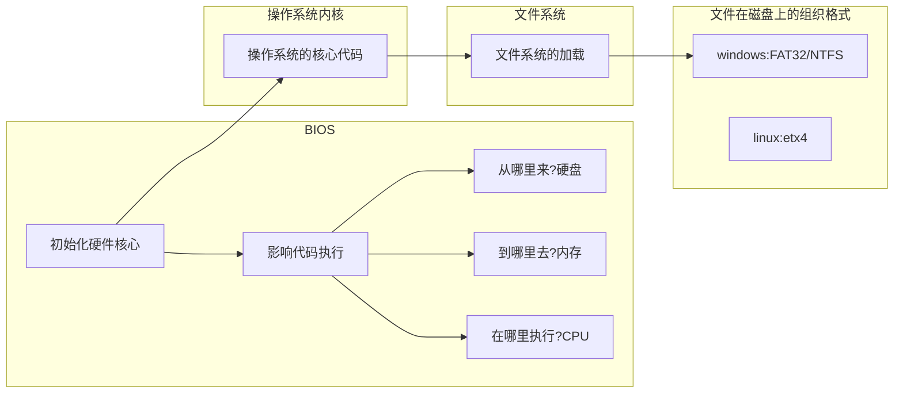
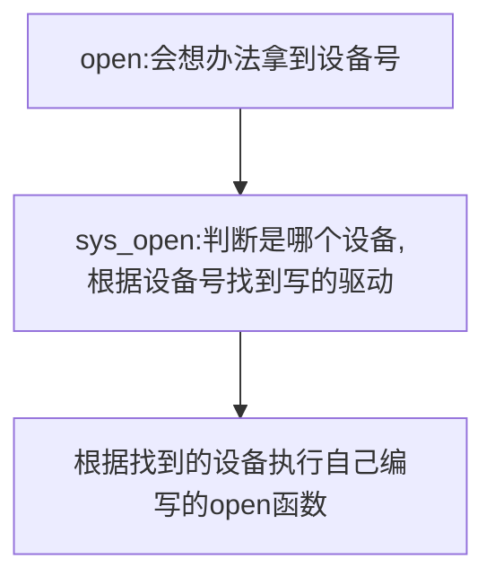

# 驱动开始

---

[TOC]

---

# 一、开始

## 1. 完整的Linux系统组成

1. **文件系统（rootfs）**：文件的存储格式。

   1. 根文件系统：内核启动所挂载的第一个文件系统。

2. **内核（kernel）**：操作系统的核心代码。

   1. 存储在flash，运行在内存。

3. **bootloader**：引导和加载操作系统内核的代码。

   >bootloader的作用：为内核运行做环境准备（加载内核/引导内核/向内核传参）

   1. 初始化：CPU/内存/flash
   2. 加载内核、引导内核
   3. 存储在flash（如前4K）

## 2. Linux启动流程

1. 拷贝NAND FLASH 前4K到片内RAM内
2. 拷贝完整的bootloader到SDRAM执行
3. bootloader必须提供一种方法加载和引导内核
4. mount根文件系统：内核运行到最后会自动挂载
5. user空间

### X86平台下的启动



### 嵌入式操作系统下的启动


## 3. **指定交叉工具链：**

>
>1. tar xvf arm-linux-gcc-4.4.3.tar.gz
>
>2.  vi /home/linux/.bashrc
>
>1. 在最后一行增加  
>
> export  PATH=$PATH:/home/linux/tools/opt/FriendlyARM/toolschain/4.4.3/bin/
# 二、Bootloader

> 1. bootloader程序，不属于kernel，但是是操作系统的必须。
> 2. bootloader的作用：为内核运行做环境准备（加载内核/引导内核/向内核传参）。
> 3. 一般不需要自己开发，一般是用芯片厂商提供的启动代码进行修改。只有对效率十分苛刻时才会进行重新开发。
> 4. 德国一个组织对全球所有的 bootloader 进行收集，形成了一套源代码uboot，如今ARM的bootloader都是用哪个uboot生成。
> 5. uboot是生成bootloader的工具。
> 6. uboot.bin——bootloader文件

## 1. 如何编译uboot源码？

**uboot顶层目录**

| 目录名、文件  | 解释                                                         |
| ------------- | ------------------------------------------------------------ |
| common        | 存放uboot指令源码,通用的函数，多是对下一层驱动程序的进一步封装 |
| disk          | 硬盘接口程序                                                 |
| examples      | 例子                                                         |
| nand_spl      | NANDFLASH操作                                                |
| **==arch==**  | 架构相关代码                                                 |
| doc           | 文档                                                         |
| nfs           | 文件系统相关操作                                             |
| net           | 网络                                                         |
| tools         | 工具相关                                                     |
| **==board==** | 支持的板子说明、板子相关、三星在samsung文件夹内              |
| drivers       | 驱动相关                                                     |
| include       | 头文件（一个.c一个头文件）                                   |
| onenand_ipl   | 只有三星会用                                                 |
| dts           | 和设备树相关                                                 |
| **lib（库）** | uboot里的公共代码存在位置                                    |
| post          | 与安全相关                                                   |
| boards.cfg    | 支持的板子说明                                               |

> CROSS_COMPILE（交叉编译）= arm-linux-
>
> ARCH=arm

## 2. uboot的编译

>通过读README
>
>1. make smdk2440_config	//确定板子型号  解析boards.cfg文件
>
>2. make  //编译工程  生成uboot.bin（GNU环境下面用.bin）

---

# ==--== day2（20190122）环境配置 --

**伪指令**：ldr nop adr（伪指令是告诉汇编程序如何进行汇编的程序）

**伪操作**：代码的排布规则

# 三、GNU的汇编规则

 **.**   :最强大的自动化变量，表示当前地址。在内存里（程序加载地址和程序运行地址一样）还是在RAM里面（程序加载地址和程序运行地址不一样）。

.madro 汇编的宏定义指令

.section  类似 area  段

"**_start:**" ：程序的起始，必须有一个全局可见的标号：_start

".global"：声明一个全局可见的标号


## （1）数据定义（Data Definition）伪操作

数据定义伪操作一般用于为特定的数据分配存储单元，同时可完成已分配存储单元的初始化。常见的数据定义伪操作有如下几种：

| 伪操作                | 解释           | 例子                        |
| --------------------- | -------------- | --------------------------- |
| .byte                 | 单字节定义     | .byte     0x12,’a’,23       |
| .short                | 定义双字节数据 | .short    0x1234,65535      |
| .long /.word          | 定义4字节数据  | .word    0x12345678         |
| .quad                 | 定义8字节数据  | .quad    0x1234567812345678 |
| .float                | 定义浮点数     | .float     0f3.2            |
| .string/.asciz/.ascii | 定义字符串     | .ascii   “abcd\0”,          |

> 注意：.ascii  伪操作定义的字符串需要每行添加结尾字符‘\0‘，其他不需要

```assembly
val:
	.word 0x11223344​      

val: 
	.word .	#(申请一个字的空间将.word的地址写入     .代表当前地址（链接地址）)
```

## （2）汇编控制伪操作

### 1. 相似c语言里的条件编译 #if #endif

> .if、.else   .endif伪操作能根据条件的成立与否决定是否执行某个指令序列。
>
>  当.if后面的逻辑表达式为真，则执行.if后的指令序列，否则执行.else后的指令序列；
>
>  .if、.else、.endif伪指令可以嵌套使用。 

**语法格式：**

```assembly
.if  logical-expressing
…
.else
…
.endif
```

### 2. macro伪操作

> macro伪操作可以将一段代码定义为一个整体，称为宏指令，然后就可以在程序中通过宏指令多次调用该段代码。

 **语法格式：**

```assembly
 .macro   macroname 

 ……..code

 .endm
```

| 伪操作         | 格式                           | 解释                                                         |
| -------------- | ------------------------------ | ------------------------------------------------------------ |
| .arm           | .arm                           | 定义一下代码使用ARM指令集编译                                |
| .thumb         | .thumb                         | 定义一下代码使用Thumb指令集编译                              |
| .section       | .section     expr              | 定义一个段。expr可以使.text   .data.   .bss                  |
| .text          | .text {subsection}             | 将定义符开始的代码编译到代码段                               |
| .data          | .data {subsection}             | 将定义符开始的代码编译到数据段,初始化数据段                  |
| .bss           | .bss {subsection}              | 将变量存放到.bss段,未初始化数据段                            |
| .align         | .align{alignment}{,fill}{,max} | 通过用零或指定的数据进行填充来使当前位置与指定边界对齐       |
| .org           | .org offset{,expr}             | 指定从当前地址加上offset开始存放代码，并且从当前地址到当前地址加上offset之间的内存单元，用零或指定的数据进行填充 |
| _start         | 标号                           | 汇编程序的缺省入口是_ start标号,用户也可以在连接脚本文件中用ENTRY标志指明其它入口点. |
| .global/.globl |                                | 用来声明一个全局的符号                                       |
| .end           |                                | 文件结束                                                     |
| .include       | .include“filename”             | 包含指定的头文件, 可以把一个汇编常量定义放在头文件中         |
| .equ           | .equ symbol, expression     | 把某一个符号(symbol)定义成某一个值(expression).该指令并不分配空间.(c语言的 #define) |

## （3）GNU汇编书写格式

代码行中的**注释符号**: ‘@’

语句**分离符号**: ‘\n’

**直接操作数前缀**: ‘#’ 

**全局标号**：地址助记符

**全局标号命名**：只能由a～z，A～Z，0～9，“.”，_等（由点、字母、数字、下划线等组成，除局部标号外，不能以数字开头）字符组成，标号的后面加“：”。

**局部标号**:局部标号 主要在局部范围内使用而且局部标号可以重复出现。

**命名**：它由两部组成开头是一个0-99直接的数字局部标号 后面加“:  

**F**：指示编译器只向前搜索，行号增大的方向

**B**：指示编译器只向后搜索，行号减小的方向

同方向有多个局部标号时，就近跳转。

.S的汇编是没有经过预处理的源文件
.s的汇编是经过预处理的源文件

# 四、ctags

> 使用ctags进行代码查看

## 1. 使用方法

1. windows下的source insight
2. linux下vi自带ctags
   1. ctags -R（在源代码的顶层目录）
   2. ctrl + ] 跳转
   3. ctrl + o 回来
   4. vi -t start_code(你要找的名字)  会全局查找  start_code 的位置

# 五、环境配置

## 1.配置TFTP服务器

1. 安装

   ```bash
   #1.使用shell安装
   sudo apt-get install tftpd
   sudo apt-get install tftpd-hpa
   sudo apt-get install ssh
   #2.使用.deb包安装
   sudo dpkg -i *.deb
   ```

2. 配置

   1. ssh

      ```bash
      sudo apt-get install openssh-client=1:5.9p1-5ubuntu1
      ```

   2. tftp

      1. 配置tftp服务器

         ```shell
         sudo vim /etc/default/tftpd-hpa
         ```

      2. 按照老师的文件进行更改

         ```shell
         TFTP_USERNAME="tftp"
         TFTP_DIRECTORY="/tftpboot"
         TFTP_ADDRESS="0.0.0.0:69"
         TFTP_OPTIONS="-l -c -s"
         ```

      3. 创建个tftp文件夹

         ```shell
         sudo mkdir /tftpboot
         sudo chmod 777 /tftpboot
         ```

      4. 重启tftp服务

         ```shell
         sudo /etc/init.d/tftpd-hpa restart
         ```

## 2. 烧写Uboot

1. 使用J-Flash v4.02烧写uboot(.bin文件)到开发板的NOR FLASH

### 2. **==uboot的作用(理解的记)==**

   1.  **汇编阶段**：设置svc模式、关闭看门狗、关闭mmu、关闭cache  初始化时钟、初始化内存、初始化存储、初始化串口，代码自拷贝（从flash到内存）、跳转到内存

   2.  **c阶段**：初始化硬件（网卡等功能器件）、加载内核、引导内核、向内核传参

      **==传参内容==**：内存大小、内存页大小（4K）、**启动参数**（告诉内核根文件系统在哪）

## 3.在Uboot交互界面进行操作

1. **uboot的环境变量**

   1. bootargs 内核启动参数 
   2. bootcmd 启动命令（自启动模式下，自动执行的指令）
   3. bootdelay 自启动等待时间
   4. gatewayip 网关
   5. ipaddr  板子的ip地址
   6. serverip  tftp服务器ip地址

2. **uboot的指令**

   1. printenv    //查看环境变量
   2. setenv  ipaddr  192.168.1.10  //设置板子的IP
   3. setenv  serverip  192.168.1.5  //设置成与板子联通的ubuntu的IP
   4. setenv ipaddr  //删除一条ipaddr，其它如serverip类似
   5. saveenv    //保存修改到flash
   6. ping 192.168.1.10  //联通则显示alive

3. **下载指令**

   1. 方法一：串口下载

      ```shell
      loadb  0x30008000
      ```

   2. 方法二：**网络传输**（选用此）

      ```shell
      tftp   0x30008000  uImage    # 从serverip指定pc上下载uImage文件到0x30008000的内存
      ```

   3. 方法三：USB下载

      ```shell
      dnw   0x30008000
      ```

4. **引导指令**

   1. 普通程序引导

      ```shell
      go  0x30008000
      ```

   2. **内核程序引导**(选用此)

      ```shell
      bootm  0x30008000
      ```

### 5. **==uboot向内核传参==**（内核要求传参）

   1. 为何要传参？

      > Bootloader与内核交互是单向的，Bootloader将各类参数传给内核。
      >
      > **由于它们不能同时运行**，传递方法只有一个：Bootloader将参数放在某个约定的地方之后，再启动内核，内核启动后从这个地方获得参数。

2. 如何传参

      1. 设备树（3.14之后 最新）

      2. tagged list标记列表（2.4x以后的版本）

      3. param_struct（最早，结构体，放到内存，把地址发给内核，内核就知道了）

## 4. ==调用内核之前需要满足的条件==

   1. CPU寄存器的设置

      * R0 = 0

      * R1 = 机器类型ID    ;对于ARM结构的CPU，机器类型 ID 可以参见 linux/arch/arm/tools/mach-types

      * R2 = 启动参数标记列表在RAM中起始基地址 

        > ;内存基地址+0x100
        >
        > 内存基地址+0x4000  mmu用
        >
        > 内存基地址+0x8000  内核用

   2. CPU工作模式

      * 必须禁止中断（ IRQs 和 FIQs ）
      * CPU 必须为 SVC 模式

   3. Cache 和 MMU 的设置

      * MMU必须关闭
      * 指令Cache可以打开也可以关闭
      * 数据Cache必须关闭

## 5.开发板加载内核流程

1. 在uboot环境检查网络 

   ```shell
   ping    tftp服务器
   # host 192.168.1.10 is alive
   ```

2. 在uboot环境下载内核镜像

   ```shell
   tftp  0x30008000 uImage    # uImage必须在tftpboot目录
   ```

3. 传递参数，告诉内核跟文件系统的位置

   ```shell
   setenv bootargs root=/dev/nfs rw nfsroot=192.168.1.5:/home/linux/nfs/rootfs_qtopia_qt4 ip=192.168.1.10 console=ttySAC0,115200 init=/linuxrc mem=64M
   ```

4. 将rootfs_qtopia_qt4-20141223.tar.gz拷贝到/home/linux/nfs

   1. 解压缩 tar  xvf  rootfs_qtopia_qt4-20141223.tar.gz

   2. 配置nfs

      1. 添加nfs路径（之后记得saveenv）

         ```shell
         sudo  vi  /etc/exports
         /home/linux/nfs/rootfs_qtopia_qt4/ *(rw,sync,no_subtree_check,no_root_squash)
         ```

      2. 重启nfs

         ```shell
         sudo /etc/init.d/nfs-kernel-server  restart
         ```

5. 引导内核启动

   ```shell
   bootm 0x30008000
   ```

6. 如果出现警告Warning: unable to open an initial console.

   ```shell
   sudo mknod console c 5 1
   sudo mknod null c 1 3
   ```

## 6. 以后每次重新启动流程

```shell
tftp 0x30008000 uImage
bootm  0x30008000
```

---

# ==--== day3 内核裁剪 --

Image         zImage            uImage(是zImage的压缩版)-----uboot

# 六、内核基础

1. 下载内核和工具

   1. www.kernel.org
   2. HTTP 下载旧版本
      1. tools编译工具，旧版本对应旧的编译工具
   3. 主版本号偶数->稳定版，奇数->测试版

2. 内核

   1. 进程管理
   2. 内存管理
   3. 文件管理
   4. 网络协议
   5. **设备管理**（后面学习的重点）

3. 内核源码分析

   1. linux-2.6.32.2

   2. 查看ubuntu内核版本

      ```shell
      cat /proc/version
      ```

      得到

      ```shell
      Linux version 3.2.0-126-generic-pae (buildd@lgw01-15) (gcc version 4.6.3 (Ubuntu/Linaro 4.6.3-1ubuntu5) ) #169-Ubuntu SMP Fri Mar 31 14:43:09 UTC 2017
      ```

   3. config_mini2440_td35

   4. 记得一定**不要**wq。

   5. 内核源码目录

      | 目录              | 解释                                                         |
      | ----------------- | :----------------------------------------------------------- |
      | **==arch==**      | 所有架构（源码）相关代码、所有平台相关（板子）代码           |
      | drivers           | 驱动源码目录（可以往里面加，尽量不要往里面改，因为有很多机制驱动） |
      | net               | 网络协议                                                     |
      | block             | 块设备操作代码（磁盘、Flash）                                |
      | firmware          | 固件（机器码）                                               |
      | README            | 说明书                                                       |
      | fs                | 文件系统                                                     |
      | include           | 系统级头文件（GNU写的）                                      |
      | init              | 初始化（从汇编进到c从此进）                                  |
      | ipc               | IPC标准进程间通信                                            |
      | kernel            | 内核核心代码                                                 |
      | tools             | 编译工具                                                     |
      | lib               | 内核库（不是C库，C库在根文件系统里的lib）                    |
      | usr               | 压缩相关的代码                                               |
      | virt              | 支持虚拟化                                                   |
      | crypto            | 加密算法                                                     |
      | mm                | 内存管理                                                     |
      | **Documentation** | 内核文档（所有的内核解释性信息）                             |

   6. 平台相关代码

      ```shell
      vim arch/arm/mach-s3c2440/mach-mini2440.c
      ```

   7. 机制驱动

      > 只是实现某种功能，以驱动形式存在

   8. IPC标准进程间通信

      1. 消息队列
      2. 信号灯
      3. 共享内存


# 七、编译内核源码

## 1. 工具链确定

> 什么是工具链？
>
> **工具**：编译、链接工具
>
> **链**：不只一个东西、按照一定的逻辑穿起来。
>
> **工具链：**和程序编译链接相关的如gcc等工具，按照先编译后链接的内在逻辑串起来的即工具链

1. 修改主Makefile（采用此）

   ```makefile
   CROSS_COMPILE = arm-linux-
   ARCH = arm
   ```

2. 修改内核参数

## 2. 确定平台（板子）

1. 确定平台指令（官方）

   ```shell
   make 板子名_defconfig	#确定板子类型
   ```

2. 确定板子名

   ```shell
   cd arch/arm/configs/
   #在此目录查找 找到板子名即可
   ```

3. 在顶层目录生成

   >在顶层目录生成	.confg（将 板子名.deconfig 拷贝(重命名) 为.config）

   ```shell
   cp config_mini2440_td35 .config	#友善之臂的方法，确定哪些文件被编译
   ```

## 3. 内核裁剪方法

   1. 进行内核裁剪（图形化）

      ```shell
      make menuconfig	#进行内核裁剪，解析所有的目录的Kconfig文件
      ```

   2. 所有的修改都会被保存到 .config

      ```shell
      [] # 空格选择 y（被编译） 或 n（不被编译）
      () # 可输入 int / hex / string
      <> # y（被编译） 或 n（不被编译） 或 m（只编译，不链接，模块化编程，生成.ko文件）
      ```

   3. 内核编译

      ```shell
      make			# 方法一
      make zImage		# 方法二 会生成zImage， y 和 m 都会被变化一
      make Image		# 方法三
      make uImage		# 方法四， 选用此
      make modules	# 方法五，只编译 m 的内容
      ```

## 4. 内核编译流程

1. 安装mkimage（有了就不用）

   1. 方法一

      ```shell
      sudo apt-get install uboot-mkimage
      ```

   2. 方法二

      1. uboot生成mkimage

         ```shell
         make tools	#会在 uboot 的 tools 目录生成 mkimage文件
         ```

      2. 拷贝 mkimage 到 bin

         ```shell
         sudo cp mkimage /bin  # 拷贝可执行文件到ubuntu根目录下bin目录下
         ```

      3. 不知道干啥的

         ```shell
         ./mkimage   -n   'linux-2.6.32'   -A  arm  -O  linux  -T  kernel  -C  none  -a 0x30008000  -e  0x30008040  -d   zImage  uImage
         ```

         

2. 在顶层目录生成	.confg

   ```shell
   cp config_mini2440_td35 .config	#友善之臂的方法，确定哪些文件被编译
   ```

3. 图形化内核裁剪

   ```shell
   make menuconfig	#进行内核裁剪 所有配置的总入口，它会包含其他目录的Kconfig
   ```

4. 内核编译

   ```shell
   make uImage		# 方法四， 选用此
   # 生成 arch/arm/bott/uImage
   ```

5. 问题解决

   ```shell
   vim arch/arm/boot/Makefile
   #64行改为：
   -C none -a $(LOADADDR) -e 0x30008040
   #原来：
   -C none -a $(LOADADDR) -e $(STARTADDR)
   ```


## 5.Kconfig（内核地图）

> 各种配置界面的源文件

1. 几乎所有目录都有 Makefile，Makefile 互相调用

2. make menuconfig 解析所有目录的 Kconifg文件

3. Kconfig（内核地图）入口：

   ```
   arch/arm/Kconfig
   ```

### （1）. 语法

1. config 定义宏

   ```makefile
   config YEGANG
   	bool	"this is test"
   config YEGANG1
   	bool	"this is test1"
   	select	YEGANG(无条件选择)
   	depends	on	YEGANG (依赖)
   ```

2. bool  双选

3. tristate  三态

4. int 

5. string

6. hex 

# 八、 内核模块编译

> 动态加载和动态删除不会影响内核正常执行的代码段。

## 8.1 ==编译方法==：

### 8.1.1 ==静态编译法==

> 把代码放到内核源码的编译

1. 创建.c文件

   > 在 **drivers/char** 目录创建 test.c

2. 追加编译

   ```makefile
   # 修改 drivers/char 的 Makefile 增加  119 行
   obj-y += test.o  # -y
   obj-m += test.o	 # -m 只会被编译到test.ko Image中不会有
   ```

3. obj-m += test.o  只会被编译为 test.ko  Image中不会有

4. 在 Makefile 中变量赋值方法

   1.  += 追加
   2.  :=(值取决于位置)  = 直接赋值
   3. ?= 赋值前判断是否赋值

5. 如果需要通过 make menuconfig 的方法确定 test.c 能否被编译

   1. 修改 drivers/char 的 Makefile 增加 obj-$(CONFIG_TEST) += test.o
      * 增加 TEST 的选项
      * 通过 make menuconfig 修改 TEST

6. 多线程

   ```shell
   make -j4 #(4线程)
   ```

   

### 8.1.2 ==动态编译法==

> 

1. 将 test.ko 拷贝到根文件系统
   * insmod test.ko 加载内核
   * lsmod 查看内核中的模块
   * rmmod test 删除模块
2. 驱动界的HelloWorld

```C
#include <linux/init.h>		//module_init 和module_exit 的头文件
#include <linux/module.h>	//MODULE_LICENSE的头文件

/* 初始化函数:模块调用时打印 */
// __init 修饰的函数在函数执行结束后，函数的内存空间会被释放，空间放到start段
static __init int test_init(void)
{
		printk("-------------------------- hello kernel -----------------------------\n");
		return 0;
}

/* 释放函数:模块删除时打印 */
// __exit 标记出口
static __exit void test_exit(void)
{
		printk("-------------------------- bye bye kernel ----------------------------\n");
}

/* 框架 */
module_init(test_init);	//带参宏，成功时，内核自动调用 module_init 修饰的函数，内核模块入口，注册函数
module_exit(test_exit);	//内核模块出口, rmmod时系统自动调用
MODULE_LICENSE("GPL");	//遵守GPL协议，不加载此将会产生内核被污染的警告“kernel tainted”
```

3. **==Makefile编写==**

   ```makefile
   obj-m := test.o
   # boj-m 表示为动态编译法
   
   # 注意这里是module不带s
   module:
   	make -C /home/linux/tools/linux-2.6.32.2/ M=$(shell pwd) modules# 这里带s
   # -c 进行预处理、编译、汇编的操作生成.o文件
   # -C 表示跳转到 /home/linux/tools/linux-2.6.32.2 读取makefile
   # M= 表示返回到当前目录继续读入、执行当前的的Makefile
   # modules 生成 module
   
   .PHONY:clean
   clean:
   	rm *.ko *.o modules.* Module.* *.mod.* 
   ```

   1. $(shell pwd)中shell是什么？

      >   这个shell应该是make里面的一个函数。
      > 从著名的《跟我一起写 Makefile》里面找到这么一段：
      >
      > 八、shell函数 
      > shell函数也不像其它的函数。顾名思义，它的参数应该就是操作系统Shell的命令。它和反引号“`”是相同的功能。这就是说，shell函数把执行操作系统命令后的输出作为函数返回。于是，我们可以用操作系统命令以及字符串处理命令awk，sed等等命令来生成一个变量，如： 
      >     contents := $(shell cat foo) 
      >     files := $(shell echo *.c) 
      > 注意，这个函数会新生成一个Shell程序来执行命令，所以你要注意其运行性能，如果你的Makefile中有一些比较复杂的规则，并大量使用了这个函数，那么对于你的系统性能是有害的。特别是Makefile的隐晦的规则可能会让你的shell函数执行的次数比你想像的多得多。   

      因此：shell是make里的一个函数，可以将后面shell命令的输出作为函数的返回值返回，于是我们便可以用$(shell pwd)获得当前工作路径。

```shell
setenv bootargs root=/dev/nfs rw nfsroot=192.168.1.5:/home/linux/nfs/_install ip=192.168.1.10 console=ttySAC0,115200 init=/linuxrc mem=64M
```

# ==--== day 4 开始写驱动 --

# 九、系统调用基础

## 9.1 内核链表

> 双向循环链表
>
> 内核链表可以将不同数据结构维护在一个链表

1. 内核链表的结构

   ```C
   // include/linux/list.h

   /* 内核链表的结构 */
   struct list_head{
       struct list_head *next, *prev;
   };
   ```

2. 定义list_head

   ```C
   // include/linux/list.h
   /* 定义list_head */
   #define LIST_HEAD(name)\
   struct list_head name = LIST_HEAD
   
   static inline void INIT_LIST_HEAD(struct list_head *list)
   {
   	list->next = list;
   	list->prev = list;
   }
   ```

3. 头插法、尾插法插入节点

   ```C
   /* 头插法插入节点
   	参数：
   		struct list_head *new 需要插入的结点
   		struct list_head *head 头结点
   */
   /**
    * list_add - add a new entry
    * @new: new entry to be added
    * @head: list head to add it after
    *
    * Insert a new entry after the specified head.
    * This is good for implementing stacks.
    */
   static inline void list_add(struct list_head *new, struct list_head *head)
   {
   	__list_add(new, head, head->next);
   }
   
   /* 尾插法插入节点
   	参数：
   		struct list_head *new 需要插入的节点
   		struct list_head *head 头结点
   */
   /**
    * list_add_tail - add a new entry
    * @new: new entry to be added
    * @head: list head to add it before
    *
    * Insert a new entry before the specified head.
    * This is useful for implementing queues.
    */
   static inline void list_add_tail(struct list_head *new, struct list_head *head)
   {
   	__list_add(new, head->prev, head);
   }
   
   ```

4. 内核链表的遍历

   ```C
   /**
    * __list_for_each	-	iterate over a list
    * @pos:	the &struct list_head to use as a loop cursor.
    * @head:	the head for your list.
    *
    * This variant differs from list_for_each() in that it's the
    * simplest possible list iteration code, no prefetching is done.
    * Use this for code that knows the list to be very short (empty
    * or 1 entry) most of the time.
    */
   #define __list_for_each(pos, head) \
   	for (pos = (head)->next; pos != (head); pos = pos->next)
   
   /**
    * list_for_each_safe - iterate over a list safe against removal of list entry
    * @pos:	the &struct list_head to use as a loop cursor.
    * @n:		another &struct list_head to use as temporary storage
    * @head:	the head for your list.
    */
   #define list_for_each_safe(pos, n, head) \
   	for (pos = (head)->next, n = pos->next; pos != (head); \
   		pos = n, n = pos->next)
   ```

## 9.2. **==带参宏和带参函数的区别==**？？

## 9.3 **==container_of 计算结构体起始地址==**

> 完成通过结构体一个成员地址，计算含有这个成员的结构体起始地址。

1. 函数

   ```C
   // include/linux/kernel.h
   // ptr 成员地址
   // type 含有这个成员的结构体的类型
   // member （知道地址的成员的）变量名
   653 #define container_of(ptr, type, member) ({          \                                     
   654     const typeof( ((type *)0)->member ) *__mptr = (ptr);    \
   655     (type *)( (char *)__mptr - offsetof(type,member) );})
   /*
   	行二：获得该成员的类型-->得到指向该成员的指针
   	行三：该指针减去偏移量即指向结构体开始
   	typeof 关键字 获得某表达式的类型
   	offsetof 宏 用于求结构体中的一个成员在该结构体中的偏移量
   */
   ```

2. 使用

   ```
   
   ```

   

## 9.4 内核空间的内存空间申请

1. **malloc：**用户空间，物理空间可能不连续，虚拟空间一定连续。

2. **kmalloc：**内核空间，物理空间一定连续

   ```C
   // include/linux/slob_def.h
   /* 
   	返回值：申请到的内存起点 
   	参数：
   	1. size_t size 
   	2. gfp_t flags:
   		include/linux/gfp.h
   		GEP_ATOMIC  一般用在中断中申请，申请不到
   		GEP_KERNEL  普通用这种
   */
   /**
    * kmalloc - allocate memory
    * @size: how many bytes of memory are required.
    * @flags: the type of memory to allocate (see kcalloc).
    *
    * kmalloc is the normal method of allocating memory
    * in the kernel.
    */
   static __always_inline void *kmalloc(size_t size, gfp_t flags)
   {
   	return __kmalloc_node(size, flags, -1);
   }
   
   // mm/slob.c
   /*
   	参数：kamlloc的返回值
   */
   void kfree(const void *block)
   {
   	struct slob_page *sp;
   
   	trace_kfree(_RET_IP_, block);
   
   	if (unlikely(ZERO_OR_NULL_PTR(block)))
   		return;
   	kmemleak_free(block);
   
   	sp = slob_page(block);
   	if (is_slob_page(sp)) {
   		int align = max(ARCH_KMALLOC_MINALIGN, ARCH_SLAB_MINALIGN);
   		unsigned int *m = (unsigned int *)(block - align);
   		slob_free(m, *m + align);
   	} else
   		put_page(&sp->page);
   }
   ```

   

3. **vmalloc：**内核空间，物理空间不一定连续，虚拟空间一定连续

   ```C
   // mm/vmalloc.c
   /* 
   	返回值：申请到的内存空间起点
   	参数：unsigned long size 
   */
   void *vmalloc(unsigned long size)
   {
   	return __vmalloc_node(size, 1, GFP_KERNEL | __GFP_HIGHMEM, PAGE_KERNEL,
   					-1, __builtin_return_address(0));
   }
   
   /* vmalloc的返回值 */
   void vfree(const void *addr)
   {
   	BUG_ON(in_interrupt());
   
   	kmemleak_free(addr);
   
   	__vunmap(addr, 1);
   }
   ```

   

# 十、 Linux的设备

## 10.1 Linux设备分类

1. **字符设备：**

   > 1. **定义**：按照字节流(一个字节一个字节读写)操作的设备
   > 2. 不支持随机访问，只支持顺序访问，一般没有缓存。
   >
   > 3. 每个字符设备在/dev目录下对应一个设备文件。
   > 4. 鼠标、键盘、串口、控制台，网口也是字符设备文件。

2. **块设备：**

   > 1. 按照设备的最小单位操作，支持随机访问。
   > 2. 如磁盘按照扇区，闪存按照块。

3. **网络设备：**

   > 面向报文，通过socket操作，打开通常使用命令行。

## 10.2 设备如何区分

1. 用户空间

   > 用户空间，每一个设备都需要一个文件名。

2. 内核空间

   > 所有的字符设备在内核内部都有一个唯一的32位**设备号**。

3. **==设备号==**：

   12 + 20

   高 12 位主设备号：设备分类 ( 0 ~ 255 )

   低 20 位次设备号：设备编号 ( 0 ~ 255 )

# 十一、 字符设备-系统调用流程

1. 系统调用

   > 特殊的接口函数，完成内核空间和用户空间的数据交互。
   >
   > 由软件中断完成 swi

2. **用户与内核交互方式**

   1. 系统调用
   2. 信号
   3. 中断

3. VFS（虚拟文件系统）

   >  虚拟文件系统：屏蔽底层的硬件差异。

4. **linux系统调用**：



## 11.1 struct cdev介绍

> 1. 描述字符设备， 包含设备号。
> 2. 每个字符设备在 linux 内核都有一个 struct cdev 结构体。
> 3. 设备有设备链表，驱动有驱动链表。

```C
// include/linux/cdev.h
// 对应一个设备操作方法
struct cdev {
	struct kobject kobj;
	struct module *owner;
	const struct file_operations *ops;// 操作方法集合，include/linux/fs.h系统调用接口，使用前需注册
    								  // 设备的操作方法入口，回调函数
	struct list_head list;	// 系统维护
	dev_t dev;				// 设备号 unsigned int
	unsigned int count;		// 设备个数
};

/*
 * NOTE:
 * read, write, poll, fsync, readv, writev, unlocked_ioctl and compat_ioctl
 * can be called without the big kernel lock held in all filesystems.
 */
struct file_operations {
	struct module *owner;
	loff_t (*llseek) (struct file *, loff_t, int);
	ssize_t (*read) (struct file *, char __user *, size_t, loff_t *);
	ssize_t (*write) (struct file *, const char __user *, size_t, loff_t *);
	ssize_t (*aio_read) (struct kiocb *, const struct iovec *, unsigned long, loff_t);
	ssize_t (*aio_write) (struct kiocb *, const struct iovec *, unsigned long, loff_t);
	int (*readdir) (struct file *, void *, filldir_t);
	unsigned int (*poll) (struct file *, struct poll_table_struct *);
	int (*ioctl) (struct inode *, struct file *, unsigned int, unsigned long);
	long (*unlocked_ioctl) (struct file *, unsigned int, unsigned long);
	long (*compat_ioctl) (struct file *, unsigned int, unsigned long);
	int (*mmap) (struct file *, struct vm_area_struct *);
	int (*open) (struct inode *, struct file *);
	int (*flush) (struct file *, fl_owner_t id);
	int (*release) (struct inode *, struct file *);
	int (*fsync) (struct file *, struct dentry *, int datasync);
	int (*aio_fsync) (struct kiocb *, int datasync);
	int (*fasync) (int, struct file *, int);
	int (*lock) (struct file *, int, struct file_lock *);
	ssize_t (*sendpage) (struct file *, struct page *, int, size_t, loff_t *, int);
	unsigned long (*get_unmapped_area)(struct file *, unsigned long, unsigned long, unsigned long, unsigned long);
	int (*check_flags)(int);
	int (*flock) (struct file *, int, struct file_lock *);
	ssize_t (*splice_write)(struct pipe_inode_info *, struct file *, loff_t *, size_t, unsigned int);
	ssize_t (*splice_read)(struct file *, loff_t *, struct pipe_inode_info *, size_t, unsigned int);
	int (*setlease)(struct file *, long, struct file_lock **);
};
```

## 11.2 struct file_operations 设备的操作方法入口


## 11.3 如何查看被用的设备号

### 11.3.1**静态**（更直接）

1. 查找被使用的设备号

   ```shell
   # 查看被使用的设备号和设备名
   cat /proc/devices
   ```

2. 注册设备号

   ```C
   // 注册设备号  fs/char_dev.c
   /*
   	返回值:
       	0 成功
   		1 失败
   	参数：
       	dev_t from 设备号（主次设备号）
       	unsigned count 注册设备号个数（最少写1）
       	const char *name 设备名
   */
   
   /**
    * register_chrdev_region() - register a range of device numbers
    * @from: the first in the desired range of device numbers; must include
    *        the major number.
    * @count: the number of consecutive device numbers required
    * @name: the name of the device or driver.
    *
    * Return value is zero on success, a negative error code on failure.
    */
   int register_chrdev_region(dev_t from, unsigned count, const char *name)
   {
   	struct char_device_struct *cd;
   	dev_t to = from + count;
   	dev_t n, next;
   
   	for (n = from; n < to; n = next) {
   		next = MKDEV(MAJOR(n)+1, 0);
   		if (next > to)
   			next = to;
   		cd = __register_chrdev_region(MAJOR(n), MINOR(n),
   			       next - n, name);
   		if (IS_ERR(cd))
   			goto fail;
   	}
   	return 0;
   fail:
   	to = n;
   	for (n = from; n < to; n = next) {
   		next = MKDEV(MAJOR(n)+1, 0);
   		kfree(__unregister_chrdev_region(MAJOR(n), MINOR(n), next - n));
   	}
   	return PTR_ERR(cd);
   }
   ```

3. 注销设备号

   ```C
   //注销设备号  fs/char_dev.c
   /*
   	dev_t 设备号
   	unsigned count 设备个数
   */
   
   /**
    * unregister_chrdev_region() - return a range of device numbers
    * @from: the first in the range of numbers to unregister
    * @count: the number of device numbers to unregister
    *
    * This function will unregister a range of @count device numbers,
    * starting with @from.  The caller should normally be the one who
    * allocated those numbers in the first place...
    */
   void unregister_chrdev_region(dev_t from, unsigned count)
   {
   	dev_t to = from + count;
   	dev_t n, next;
   
   	for (n = from; n < to; n = next) {
   		next = MKDEV(MAJOR(n)+1, 0);
   		if (next > to)
   			next = to;
   		kfree(__unregister_chrdev_region(MAJOR(n), MINOR(n), next - n));
   	}
   }
   ```

   

### 11.3.2 动态（驱动的适应能力更强）

1. 注册设备号

   ```C
   // 动态注册设备号
   /*
   	返回值：
   		0 成功
      		非0 失败
      	参数：
      		dev_t *dev 申请成功，将设备号写入dev
      		unsigned baseminor 次设备号起点
      		unsigned count 设备个数
      		const char *name 设备名
   */
   /**
    * alloc_chrdev_region() - register a range of char device numbers
    * @dev: output parameter for first assigned number
    * @baseminor: first of the requested range of minor numbers
    * @count: the number of minor numbers required
    * @name: the name of the associated device or driver
    *
    * Allocates a range of char device numbers.  The major number will be
    * chosen dynamically, and returned (along with the first minor number)
    * in @dev.  Returns zero or a negative error code.
      */
      int alloc_chrdev_region(dev_t *dev, unsigned baseminor, unsigned count,
      		const char *name)
      {
      struct char_device_struct *cd;
      cd = __register_chrdev_region(0, baseminor, count, name);
      if (IS_ERR(cd))
      	return PTR_ERR(cd);
      *dev = MKDEV(cd->major, cd->baseminor);
      return 0;
      }
   ```

   

## 11.4 struct cdev的初始化、添加、删除

```C
// 初始化 cdev 结构体
/*
	返回值：
		没有
	参数：
		struct cdev *cdev 需要初始化的 cdev 结构体
		const struct file_operations *fops 需要注册的操作方法集合
*/
/**
 * cdev_init() - initialize a cdev structure
 * @cdev: the structure to initialize
 * @fops: the file_operations for this device
 *
 * Initializes @cdev, remembering @fops, making it ready to add to the
 * system with cdev_add().
 */
void cdev_init(struct cdev *cdev, const struct file_operations *fops)
{
	memset(cdev, 0, sizeof *cdev);
	INIT_LIST_HEAD(&cdev->list);
	kobject_init(&cdev->kobj, &ktype_cdev_default);
	cdev->ops = fops;
}

/*
	从系统添加cdev
	返回值：
		0 成功
		非0 失败
	参数：
		struct cdev *p 需要增加的 cdev
		dev_t dev 设备号
		unsigned count 设备个数(最少为1)
*/
// 向系统添加 cdev 结构体
/**
 * cdev_add() - add a char device to the system
 * @p: the cdev structure for the device
 * @dev: the first device number for which this device is responsible
 * @count: the number of consecutive minor numbers corresponding to this
 *         device
 *
 * cdev_add() adds the device represented by @p to the system, making it
 * live immediately.  A negative error code is returned on failure.
 */
int cdev_add(struct cdev *p, dev_t dev, unsigned count)
{
	p->dev = dev;
	p->count = count;
	return kobj_map(cdev_map, dev, count, NULL, exact_match, exact_lock, p);
}

/*
	从系统删除需要删除cdev
*/
/**
 * cdev_del() - remove a cdev from the system
 * @p: the cdev structure to be removed
 *
 * cdev_del() removes @p from the system, possibly freeing the structure
 * itself.
 */
void cdev_del(struct cdev *p)
{
	cdev_unmap(p->dev, p->count);
	kobject_put(&p->kobj);
}
```

## 11.5 完成一个字符设备驱动流程

1. 定义 struct cdev
2. 定义 struct file_operations
3. 初始化 file_operations
4. 注册设备号
5. 初始化 cdev
6. 向系统增加 cdev

## 11.6 **手动创建设备节点**

```shell
mknod  /dev/my  c        250      0
# 指令  设备节点  设备类型  主设备号  次设备号
```

## 11.7 用户空间和内核空间数据拷贝

> 偏移量：loff_t *lof
>
> **用户空间指针不能直接在内核中被直接调用。**

```C
// arch/arm/include/asm/uaccess.h
//完成从用户空间到内核空间数据拷贝
/*
	返回值：
		0 成功
		非0 失败
	参数：
	void *to 用户空间
	 const void __user *from 内核空间
	 unsigned long n 需要拷贝的大小
*/

static inline unsigned long __must_check copy_from_user(void *to, const void __user *from, unsigned long n)
{
	if (access_ok(VERIFY_READ, from, n))
		n = __copy_from_user(to, from, n);
	else /* security hole - plug it */
		memset(to, 0, n);
	return n;
}

//完成内核空间到用户看空间的数据拷贝
static inline unsigned long __must_check copy_to_user(void __user *to, const void *from, unsigned long n)
{
	if (access_ok(VERIFY_WRITE, to, n))
		n = __copy_to_user(to, from, n);
	return n;
}
```


## 11.8 数据流向


1. 应用程序使用库函数open打开设备文件
2. 库函数根据传入的参数执行"swi 指令"，这条指令引起CPU异常，进入内核。
3. 内核的异常处理函数根据这些参数找到相应的驱动程序，返回一个文件句柄给库函数，库函数返回给应用程序。
4. 应用程序得到文件句柄后，使用库函数write等发出控制指令
5. 库函数根据传入的参数执行"swi 指令"，这条指令引起CPU异常，进入内核。
6. 内核的异常处理函数根据这些参数调用驱动程序的相关函数。