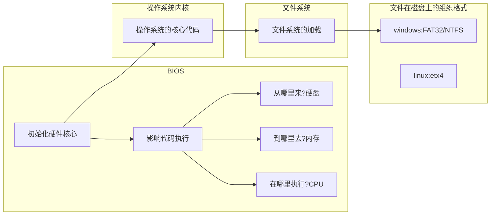

# 驱动开始

---

## 一、开始

### 1. 完整的Linux系统组成

1. **文件系统（rootfs）**：文件的存储格式。

   1. 根文件系统：内核启动所挂载的第一个文件系统。

2. **内核（kernel）**：操作系统的核心代码。

   1. 存储在flash，运行在内存。

3. **bootloader**：引导和加载操作系统内核的代码。

   >bootloader的作用：为内核运行做环境准备（加载内核/引导内核/向内核传参）

   1. 初始化：CPU/内存/flash
   2. 加载内核、引导内核
   3. 存储在flash（如前4K）

### 2. Linux启动流程

1. 拷贝NAND FLASH 前4K到片内RAM内
2. 拷贝完整的bootloader到SDRAM执行
3. bootloader必须提供一种方法加载和引导内核
4. mount根文件系统：内核运行到最后会自动挂载
5. user空间

### X86平台下的启动



### 嵌入式操作系统下的启动


### 3. **指定交叉工具链：**

>
>1. tar xvf arm-linux-gcc-4.4.3.tar.gz
>
>2.  vi /home/linux/.bashrc
>
>1. 在最后一行增加  
>
> export  PATH=$PATH:/home/linux/tools/opt/FriendlyARM/toolschain/4.4.3/bin/
## 二、Bootloader

> 1. bootloader程序，不属于kernel，但是是操作系统的必须。
> 2. bootloader的作用：为内核运行做环境准备（加载内核/引导内核/向内核传参）。
> 3. 一般不需要自己开发，一般是用芯片厂商提供的启动代码进行修改。只有对效率十分苛刻时才会进行重新开发。
> 4. 德国一个组织对全球所有的 bootloader 进行收集，形成了一套源代码uboot，如今ARM的bootloader都是用哪个uboot生成。
> 5. uboot是生成bootloader的工具。
> 6. uboot.bin——bootloader文件

### 1. 如何编译uboot源码？

**uboot顶层目录**

| 目录名、文件  | 解释                                                         |
| ------------- | ------------------------------------------------------------ |
| common        | 存放uboot指令源码,通用的函数，多是对下一层驱动程序的进一步封装 |
| disk          | 硬盘接口程序                                                 |
| examples      | 例子                                                         |
| nand_spl      | NANDFLASH操作                                                |
| **==arch==**  | 架构相关代码                                                 |
| doc           | 文档                                                         |
| nfs           | 文件系统相关操作                                             |
| net           | 网络                                                         |
| tools         | 工具相关                                                     |
| **==board==** | 支持的板子说明、板子相关、三星在samsung文件夹内              |
| drivers       | 驱动相关                                                     |
| include       | 头文件（一个.c一个头文件）                                   |
| onenand_ipl   | 只有三星会用                                                 |
| dts           | 和设备树相关                                                 |
| **lib（库）** | uboot里的公共代码存在位置                                    |
| post          | 与安全相关                                                   |
| boards.cfg    | 支持的板子说明                                               |

> CROSS_COMPILE（交叉编译）= arm-linux-
>
> ARCH=arm

### 2. uboot的编译

>通过读README
>
>1. make smdk2440_config	//确定板子型号  解析boards.cfg文件
>
>2. make  //编译工程  生成uboot.bin（GNU环境下面用.bin）

---

## day2（20190122）

**伪指令**：ldr nop adr（伪指令是告诉汇编程序如何进行汇编的程序）

**伪操作**：代码的排布规则

## 三、GNU的汇编规则

 **.**   :最强大的自动化变量，表示当前地址。在内存里（程序加载地址和程序运行地址一样）还是在RAM里面（程序加载地址和程序运行地址不一样）。

.madro 汇编的宏定义指令

.section  类似 area  段

"**_start:**" ：程序的起始，必须有一个全局可见的标号：_start

".global"：声明一个全局可见的标号


### （1）数据定义（Data Definition）伪操作

数据定义伪操作一般用于为特定的数据分配存储单元，同时可完成已分配存储单元的初始化。常见的数据定义伪操作有如下几种：

| 伪操作                | 解释           | 例子                        |
| --------------------- | -------------- | --------------------------- |
| .byte                 | 单字节定义     | .byte     0x12,’a’,23       |
| .short                | 定义双字节数据 | .short    0x1234,65535      |
| .long /.word          | 定义4字节数据  | .word    0x12345678         |
| .quad                 | 定义8字节数据  | .quad    0x1234567812345678 |
| .float                | 定义浮点数     | .float     0f3.2            |
| .string/.asciz/.ascii | 定义字符串     | .ascii   “abcd\0”,          |

> 注意：.ascii  伪操作定义的字符串需要每行添加结尾字符‘\0‘，其他不需要

```assembly
val:
	.word 0x11223344​      

val: 
	.word .	#(申请一个字的空间将.word的地址写入     .代表当前地址（链接地址）)
```

### （2）汇编控制伪操作

#### 1. 相似c语言里的条件编译 #if #endif

> .if、.else   .endif伪操作能根据条件的成立与否决定是否执行某个指令序列。
>
>  当.if后面的逻辑表达式为真，则执行.if后的指令序列，否则执行.else后的指令序列；
>
>  .if、.else、.endif伪指令可以嵌套使用。 

**语法格式：**

```assembly
.if  logical-expressing
…
.else
…
.endif
```

#### 2. macro伪操作

> macro伪操作可以将一段代码定义为一个整体，称为宏指令，然后就可以在程序中通过宏指令多次调用该段代码。

 **语法格式：**

```assembly
 .macro   macroname 

 ……..code

 .endm
```

| 伪操作         | 格式                           | 解释                                                         |
| -------------- | ------------------------------ | ------------------------------------------------------------ |
| .arm           | .arm                           | 定义一下代码使用ARM指令集编译                                |
| .thumb         | .thumb                         | 定义一下代码使用Thumb指令集编译                              |
| .section       | .section     expr              | 定义一个段。expr可以使.text   .data.   .bss                  |
| .text          | .text {subsection}             | 将定义符开始的代码编译到代码段                               |
| .data          | .data {subsection}             | 将定义符开始的代码编译到数据段,初始化数据段                  |
| .bss           | .bss {subsection}              | 将变量存放到.bss段,未初始化数据段                            |
| .align         | .align{alignment}{,fill}{,max} | 通过用零或指定的数据进行填充来使当前位置与指定边界对齐       |
| .org           | .org offset{,expr}             | 指定从当前地址加上offset开始存放代码，并且从当前地址到当前地址加上offset之间的内存单元，用零或指定的数据进行填充 |
| _start         | 标号                           | 汇编程序的缺省入口是_ start标号,用户也可以在连接脚本文件中用ENTRY标志指明其它入口点. |
| .global/.globl |                                | 用来声明一个全局的符号                                       |
| .end           |                                | 文件结束                                                     |
| .include       | .include“filename”             | 包含指定的头文件, 可以把一个汇编常量定义放在头文件中         |
| .equ           | .equ symbol, expression     | 把某一个符号(symbol)定义成某一个值(expression).该指令并不分配空间.(c语言的 #define) |

### （3）GNU汇编书写格式

代码行中的**注释符号**: ‘@’

语句**分离符号**: ‘\n’

**直接操作数前缀**: ‘#’ 

**全局标号**：地址助记符

**全局标号命名**：只能由a～z，A～Z，0～9，“.”，_等（由点、字母、数字、下划线等组成，除局部标号外，不能以数字开头）字符组成，标号的后面加“：”。

**局部标号**:局部标号 主要在局部范围内使用而且局部标号可以重复出现。

**命名**：它由两部组成开头是一个0-99直接的数字局部标号 后面加“:  

**F**：指示编译器只向前搜索，行号增大的方向

**B**：指示编译器只向后搜索，行号减小的方向

同方向有多个局部标号时，就近跳转。

.S的汇编是没有经过预处理的源文件
.s的汇编是经过预处理的源文件

## 四、ctags

> 使用ctags进行代码查看

### 1. 使用方法

1. windows下的source insight
2. linux下vi自带ctags
   1. ctags -R（在源代码的顶层目录）
   2. ctrl + ] 跳转
   3. ctrl + o 回来
   4. vi -t start_code(你要找的名字)  会全局查找  start_code 的位置

## 五、环境配置

### 1.配置TFTP服务器

1. 安装

   ```bash
   #1.使用shell安装
   sudo apt-get install tftpd
   sudo apt-get install tftpd-hpa
   sudo apt-get install ssh
   #2.使用.deb包安装
   sudo dpkg -i *.deb
   ```

2. 配置

   1. ssh

      ```bash
      sudo apt-get install openssh-client=1:5.9p1-5ubuntu1
      ```

   2. tftp

      1. 配置tftp服务器

         ```shell
         sudo vim /etc/default/tftpd-hpa
         ```

      2. 按照老师的文件进行更改

         ```shell
         TFTP_USERNAME="tftp"
         TFTP_DIRECTORY="/tftpboot"
         TFTP_ADDRESS="0.0.0.0:69"
         TFTP_OPTIONS="-l -c -s"
         ```

      3. 创建个tftp文件夹

         ```shell
         sudo mkdir /tftpboot
         sudo chmod 777 /tftpboot
         ```

      4. 重启tftp服务

         ```shell
         sudo /etc/init.d/tftpd-hpa restart
         ```

### 2. 烧写Uboot

1. 使用J-Flash v4.02烧写uboot(.bin文件)到开发板的NOR FLASH

2. **uboot的作用**

   1.  **汇编阶段**：设置svc模式、关闭看门狗、关闭mmu、关闭cache  初始化时钟、初始化内存、初始化存储、初始化串口，代码自拷贝（从flash到内存）、跳转到内存

   2.  **c阶段**：初始化硬件（网卡等功能器件）、加载内核、引导内核、向内核传参

      **==传参内容==**：内存大小、内存页大小（4K）、启动参数（告诉内核根文件系统在哪）

### 3.在Uboot交互界面进行操作

1. **uboot的环境变量**

   1. bootargs 内核启动参数 
   2. bootcmd 启动命令（自启动模式下，自动执行的指令）
   3. bootdelay 自启动等待时间
   4. gatewayip 网关
   5. ipaddr  板子的ip地址
   6. serverip  tftp服务器ip地址

2. **uboot的指令**

   1. printenv    //查看环境变量
   2. setenv  ipaddr  192.168.1.10  //设置板子的IP
   3. setenv  serverip  192.168.1.5  //设置成与板子联通的ubuntu的IP
   4. setenv ipaddr  //删除一条ipaddr，其它如serverip类似
   5. saveenv    //保存修改到flash
   6. ping 192.168.1.10  //联通则显示alive

3. **下载指令**

   1. 方法一：串口下载

      ```shell
      loadb  0x30008000
      ```

   2. 方法二：**网络传输**（选用此）

      ```shell
      tftp   0x30008000  uImage    # 从serverip指定pc上下载uImage文件到0x30008000的内存
      ```

   3. 方法三：USB下载

      ```shell
      dnw   0x30008000
      ```

4. **引导指令**

   1. 普通程序引导

      ```shell
      go  0x30008000
      ```

   2. **内核程序引导**(选用此)

      ```shell
      bootm  0x30008000
      ```

5. **uboot向内核传参**（内核要求传参）

   1. 为何要传参？

      > Bootloader与内核交互是单向的，Bootloader将各类参数传给内核。
      >
      > **由于它们不能同时运行**，传递方法只有一个：Bootloader将参数放在某个约定的地方之后，再启动内核，内核启动后从这个地方获得参数。

      

      1. 设备树（最新）

      2. tagged list标记列表（2.4x以后的版本）

      3. param_struct（最早，结构体，放到内存，把地址发给内核，内核就知道了）

### 4. ==调用内核之前需要满足的条件==

   1. CPU寄存器的设置

      * R0 = 0

      * R1 = 机器类型ID    ;对于ARM结构的CPU，机器类型 ID 可以参见 linux/arch/arm/tools/mach-types

      * R2 = 启动参数标记列表在RAM中起始基地址 

        > ;内存基地址+0x100
        >
        > 内存基地址+0x4000  mmu用
        >
        > 内存基地址+0x8000  内核用

   2. CPU工作模式

      * 必须禁止中断（ IRQs 和 FIQs ）
      * CPU 必须为 SVC 模式

   3. Cache 和 MMU 的设置

      * MMU必须关闭
      * 指令Cache可以打开也可以关闭
      * 数据Cache必须关闭

### 5.开发板加载内核流程

1. 在uboot环境检查网络 

   ```shell
   ping    tftp服务器
   # host 192.168.1.10 is alive
   ```

2. 在uboot环境下载内核镜像

   ```shell
   tftp  0x30008000 uImage    # uImage必须在tftpboot目录
   ```

3. 传递参数，告诉内核跟文件系统的位置

   ```shell
   setenv bootargs root=/dev/nfs rw nfsroot=192.168.1.5:/home/linux/nfs/rootfs_qtopia_qt4 ip=192.168.1.10 console=ttySAC0,115200 init=/linuxrc mem=64M
   ```

4. 将rootfs_qtopia_qt4-20141223.tar.gz拷贝到/home/linux/nfs

   1. 解压缩 tar  xvf  rootfs_qtopia_qt4-20141223.tar.gz

   2. 配置nfs

      1. 添加nfs路径

         ```shell
         sudo  vi  /etc/exports
         /home/linux/nfs/rootfs_qtopia_qt4/ *(rw,sync,no_subtree_check,no_root_squash)
         ```

      2. 重启nfs

         ```shell
         sudo /etc/init.d/nfs-kernel-server  restart
         ```

5. 引导内核启动

   ```shell
   bootm 0x30008000
   ```

### 6. 以后每次重新启动流程

```shell
tftp 0x30008000 uImage
bootm  0x30008000
```


